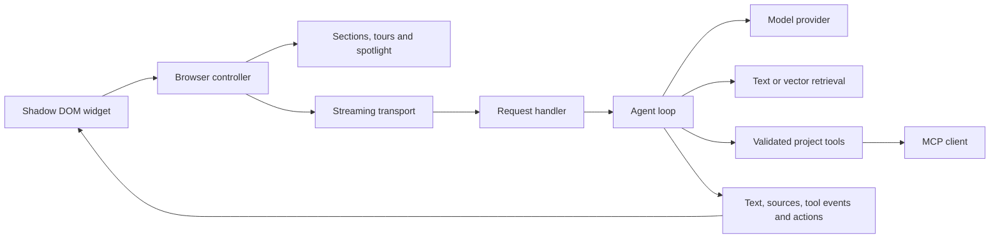

<div align="center">
  
  <h1>OrfinSupport</h1>
  <p><strong>A little guidance goes a long way.</strong></p>
  <p>Meet Orfin — an assistant that understands your product,<br/>shows people where to go, and stays for the follow-up question.</p>
  <p>
    <a href="https://arconw.github.io/OrfinSupport/">Explore the playground</a> ·
    <a href="#bring-orfin-to-your-project">Get started</a> ·
    <a href="docs/API.md">API reference</a> ·
    <a href="docs/INTEGRATIONS.md">Integrations</a>
  </p>
  <p>
    <a href="LICENSE"></a>
    
    
    
  </p>
  
  <p><sub>Recorded from the working playground: chat motion, the Actions menu, guided tours, grounded analysis and a cart that actually changes.</sub></p>
</div>

**Bring your own LLM provider and model.** Connect a compatible Chat Completions API, Anthropic Messages, or a custom `ModelProvider` adapter. OrfinSupport supplies the widget, streaming agent loop, context, tools and page interactions; your backend owns credentials and access. Compatibility depends on the provider’s protocol and capabilities. [Provider examples](#models-and-context).

## A guide that can point

Your visitors can ask a question, take a tour, or point at the part of the interface they want to understand. Orfin connects the conversation to the page in front of them.

| Capability                   | What it does                                                                                                                                                                 |
| ---------------------------- | ---------------------------------------------------------------------------------------------------------------------------------------------------------------------------- |
| **Tours with questions**     | Walks through ordered sections with Back, Next and Ask. Continue from inside the chat or return to the current tour step.                                                    |
| **Section picker**           | Highlights the section under the pointer; selecting it starts an explanation. A keyboard-accessible section list is included.                                                |
| **Thoughtful hover help**    | Offers Yes / No after a configurable dwell time. Outside clicks dismiss it; a cooldown prevents repeated interruptions.                                                      |
| **Navigation and spotlight** | Opens an allowed page, waits for its section, scrolls into view and softly dims the background by 15% for two seconds, with configurable opacity and smooth transitions.     |
| **Project knowledge**        | Combines a trusted project prompt, section instructions and retrieved documents. Responses can include source links.                                                         |
| **Your tools and MCP**       | Calls validated server and MCP tools, updates your interface through registered actions, and explains the result.                                                            |
| **Real streaming**           | Streams text, tool activity, sources and browser actions. Includes cancellation, retry and useful connection errors.                                                         |
| **Actions within reach**     | A labelled menu below the composer opens tours, section selection and page explanations, including after a conversation has started. Supports touch and keyboard navigation. |
| **Considered motion**        | Coordinated panel, menu, welcome, message, tool and settings transitions. Runtime control, host CSS timing and automatic reduced-motion support.                             |
| **Your product’s style**     | Ten presets (five light, five dark), an unthemed host mode, reactive custom logos, CSS variables and shadow parts. Shadow DOM protects the interface from host styles.       |
| **16 languages**             | Localizes the widget, tooltips, tours and errors. Switch languages without remounting; the chosen locale also controls model replies.                                        |
| **Configurable behavior**    | Switch features on or off at runtime. Choose marked sections or visible-page context, dwell time, language and memory policy.                                                |

The library is framework independent. React, Vue and Angular adapters manage the same widget’s lifecycle. Next.js uses the React adapter plus a standard Web `Request → Response` route handler. The widget includes 16 languages, English by default, regional and custom translation fallback, and Arabic RTL layout. Language changes work through widget preferences, configuration and reactive framework APIs. [Localization guide](docs/LOCALIZATION.md).

## Your project’s actions

**Put your own commands in the Actions menu.** Orfin is a configurable project assistant; the shop is one example. A report can offer “Analyze results”, a workspace “Find a project”, and a catalog “Compare products”. Built-in commands can be removed, reordered or combined with your commands, without replacing the conversation.

```ts
import { createOrfin, type CustomMenuAction } from 'orfinsupport';

const compare: CustomMenuAction = {
  id: 'compare-products',
  label: 'Compare products',
  translations: {
    ru: { label: 'Сравнить товары' },
    fr: { label: 'Comparer les produits' },
  },
  prompt: 'Use compare_products to compare Luma 27 and Luma 32 Pro for a small desk.',
  requires: ['tools'],
  visible: ({ url }) => new URL(url).pathname.startsWith('/products'),
};

const orfin = createOrfin({
  endpoint: '/api/orfin',
  menuActions: [compare, 'tour', 'pick', 'page'],
});

orfin.updateSettings({ menuActions: ['page', compare] });
orfin.updateSettings({ menuActions: [] });
orfin.updateSettings({ menuActions: null });
```

The button submits its configured prompt through the normal streaming conversation. Your backend registers the `compare_products` tool, reads **your catalog**, validates arguments and returns real characteristics and prices. The model explains those results; Orfin is not a source of product facts. Keep the provider key, catalog credentials and tool authorization on the server. `requires` controls visibility in the interface; server feature policy and authorization still control execution. See the [working project menu](demo/menu-actions.ts), [catalog tools](demo/tools.ts) and [backend tool integration](#tools-that-belong-to-your-product).

The demo adds **Compare products** on Equipment/product/comparison pages and **Analyze delivery** on Reports, in both Demo replies and Live AI. Playground’s **Actions menu** setting demonstrates standard, reordered, contextual and empty lists. Your project can replace `menuActions` through React’s hook, Vue’s composable or Angular’s injected API after a route or selection changes. Predicates are reevaluated on hash/popstate navigation, observed page changes and settings updates; after a History API change with no DOM update, call `orfin.refreshPage()`. History, drafts and the selected logo remain intact. [Full menu API](docs/API.md#actions-menu).

## Try it locally

```bash
git clone https://github.com/arconw/OrfinSupport.git
cd OrfinSupport
npm ci
npm run dev
```

Open **http://127.0.0.1:4173**. Northstar is a fictional studio workspace with working projects, tasks, a delivery report, equipment catalog, product details, comparisons, customer reviews, a demo cart and assistant settings.

**Demo replies** work without a backend or API credentials, including on GitHub Pages. The public static playground disables **Live AI** and links to local setup. **Live AI** sends requests through the demo server to your configured model provider. Set `ORFIN_API_URL`, `ORFIN_MODEL`, `ORFIN_API_KEY` (when required) and `ORFIN_TOOL_MODE` in the server environment. Use `native` for compatible function calling or `prompt` for text-only endpoints. The development defaults and validation setup are described in [Integrations](docs/INTEGRATIONS.md#local-development-provider). The live server automatically connects an actual MCP client/server pair with `workspace_statistics` and `team_capacity`. **Connected tools** in Playground is enabled by default; there is no separate MCP switch.

Try these in either mode:

| Scenario          | Ask Orfin                                                                    | Visible result                                                                                            |
| ----------------- | ---------------------------------------------------------------------------- | --------------------------------------------------------------------------------------------------------- |
| Interpret results | “Analyze our delivery results. Compare Brand and Web and cite the evidence.” | Opens the chart; explains 48 → 66 tasks (+37.5%), segment differences and the limits of causal inference. |
| Act on a product  | “Open Luma 27 and add two to my cart.”                                       | Opens the real product page; the cart shows two displays and $698.                                        |
| Compare           | “Compare Luma 27 and Luma 32 Pro for a small desk.”                          | Opens the specification table and explains the $250 difference and practical limitations.                 |
| Read the evidence | “Find the 3-star review for Luma 32 Pro. Why that rating?”                   | Retrieves Maya Chen’s actual mock review: 90 W versus a 140 W laptop, plus the larger stand.              |
| Adjust a decision | “Set Luma 27 quantity to 1.” Then “Remove Luma 27 from my cart.”             | Quantity and totals change through the cart tool. Manual quantity/removal controls also work.             |
| Explore           | “Open the knowledge page”, or start a tour and choose Ask.                   | Page navigation, a soft spotlight and a conversation that keeps the current tour step.                    |

Public **Demo replies** use deterministic scenario matching, localized answers and the same catalog/report/cart operations as Live AI. They perform actual local interface changes; they are not a general language model. Live AI chooses tools using your model through the real backend. Demo carts live in memory; Live AI carts are separate, browser-session-isolated server memory and expire after one hour of inactivity. No checkout, order or payment is available.

To try MCP, select **Live AI** and ask: “Please call the connected MCP workspace statistics tool and tell me the completed task count. Use the tool, not the knowledge documents.” Orfin shows **workspace statistics · Done** and reports **24 tasks this week**, using the same fictional data as the overview. Demo replies simulate conversations; actual MCP calls require Live AI and the local backend. The answer follows the language selected in assistant preferences.

<table>
<tr><td></td><td></td></tr>
</table>

For a stable production preview with both Demo replies and Live AI, run `npm run preview:demo` and open **http://127.0.0.1:4189**. It builds an isolated copy of the frontend and API; source edits and subsequent builds do not reload an ongoing review. Start a new snapshot on another port with `npm run preview:demo -- --port 4190`. A configured model endpoint is required only for Live AI.

`npm run build:demo` produces the static playground with Live AI disabled. `npm run dev` and `npm run preview:demo` enable it automatically. For a custom demo deployment with a same-origin `/api/orfin` backend, build with `VITE_ORFIN_DEMO_LIVE=true npm run build:demo`.

## Bring Orfin to your project

**Release status:** `0.1.0` is prepared for publication; it has not been published to npm yet. Build and install a local tarball for now:

```bash
npm ci
npm pack
cd /path/to/your-app
npm install /path/to/OrfinSupport/orfinsupport-0.1.0.tgz
```

### 1. Describe your sections

Put public descriptions in a catalog shared by your frontend and backend. Keep sensitive instructions and authorization logic on the server.

```ts
import type { Section } from 'orfinsupport/core';

export const sections: Section[] = [
  {
    id: 'projects',
    title: 'Your projects',
    description: 'Track each project, its people, progress, and next milestone.',
    path: '/projects',
    tourOrder: 0,
  },
];
```

```html
<section data-orfin-section="projects">
  <h2>Your projects</h2>
</section>
```

For simple pages, descriptions can live entirely in markup:

```html
<section
  data-orfin-section="pricing"
  data-orfin-title="Plans and pricing"
  data-orfin-description="Compare the available plans and their included features."
  data-orfin-order="1"
>
  <h2>Find your plan</h2>
</section>
```

### 2. Mount the assistant

```ts
import { createOrfin } from 'orfinsupport';
import { sections } from './sections';

const orfin = createOrfin({
  endpoint: '/api/orfin',
  sections,
  theme: 'cloud',
  features: { hoverHelp: true },
  navigate: (path) => router.push(path),
  allowedPaths: ['/projects'],
});

orfin.updateSettings({ hoverDelay: 3000 });
```

Call `orfin.destroy()` when the host view unmounts. Without a router callback, allowed navigation uses a full page load and briefly stores the destination section in session storage so the next mount can highlight it.

### 3. Connect your backend

For Next.js, put this in `app/api/orfin/route.ts`. The same handler works anywhere that accepts standard Web requests and responses.

```ts
import { createOrfinHandler, createOpenAICompatible } from 'orfinsupport/server';
import { sections } from '@/lib/sections';

export const POST = createOrfinHandler({
  provider: createOpenAICompatible({
    baseURL: process.env.ORFIN_API_URL!,
    apiKey: process.env.ORFIN_API_KEY,
    model: process.env.ORFIN_MODEL!,
  }),
  context: 'Our product helps creative teams plan and deliver client projects.',
  sections: sections.map((section) => ({
    ...section,
    prompt: 'Explain the workflow clearly. Never claim a project was modified.',
  })),
  allowedPaths: ['/projects'],
});
```

Set `ORFIN_API_URL`, `ORFIN_API_KEY` and `ORFIN_MODEL` in the **host application's server environment**. They must not use a public frontend prefix such as `NEXT_PUBLIC_` or `VITE_`. The library does not load environment files or include credentials. [Authentication, request limits and deployment boundaries](docs/INTEGRATIONS.md#server-boundaries).

## Frameworks

<table>
<tr><th>React / Next.js</th><th>Vue</th><th>Angular</th></tr>
<tr><td><code>orfinsupport/react</code><br/>Provider, reactive <code>useOrfin()</code> hook and automatic cleanup.</td><td><code>orfinsupport/vue</code><br/>Component and <code>useOrfin()</code> composable with writable locale.</td><td><code>orfinsupport/angular</code><br/>Environment provider, controller and <code>injectOrfin()</code> signals.</td></tr>
</table>

```tsx
'use client';

import { OrfinSupport } from 'orfinsupport/react';

export function Assistant() {
  return <OrfinSupport options={{ endpoint: '/api/orfin', theme: 'cloud' }} />;
}
```

See [framework recipes](docs/INTEGRATIONS.md#framework-recipes) and the [runnable Next.js example](examples/next). The React distribution preserves its `use client` boundary. Server imports do not access the DOM. Changing feature settings updates a mounted adapter; remount it when replacing the transport, catalog or router.

## Change the language

```ts
const orfin = createOrfin({ endpoint: '/api/orfin', locale: 'en' });
orfin.setLocale('ja');
```

Visitors can also choose a language in assistant preferences. React exposes `useOrfin().setLocale()`, Vue exposes a writable `locale` computed ref, and Angular exposes `injectOrfin().locale()` and `setLocale()`. Supply partial `translations` overrides or localized section descriptions; missing text falls back to English. [Examples and fallback behavior](docs/LOCALIZATION.md).

## Models and context

**You choose the endpoint and model.** Native adapters cover two protocols; a different protocol needs a custom adapter. Model names are passed to the selected provider unchanged. The browser calls your `/api/orfin` route, and that route calls the provider.

| Adapter / mode                                           | Streaming                                               | Tools and differences                                                                                                                                             |
| -------------------------------------------------------- | ------------------------------------------------------- | ----------------------------------------------------------------------------------------------------------------------------------------------------------------- |
| `createOpenAICompatible`, `toolMode: 'native'` (default) | Chat Completions SSE text deltas                        | Requires compatible function-call deltas and tool-result messages. The adapter appends `/chat/completions` to `baseURL`.                                          |
| `createOpenAICompatible`, `toolMode: 'prompt'`           | Text deltas; a tool envelope is buffered until complete | For gateways without native function calling. The model must follow the tool envelope; execution still uses JSON Schema validation and feature gates.             |
| `createOpenAICompatible`, `toolMode: 'none'`             | Text deltas                                             | No model-selected tools. Disable tool/navigation features on the handler for a text-only deployment. User-operated tours and picking can still run in the widget. |
| `createAnthropic`                                        | Native Messages SSE text deltas                         | Native `tool_use` / `tool_result`; configure `maxTokens`. Its base URL defaults to `https://api.anthropic.com/v1`.                                                |
| Your `ModelProvider`                                     | You yield `delta` events                                | Yield complete `tool_call` events if the upstream supports tools. Translate its message and stream formats yourself.                                              |

For any compatible API, set your service’s base URL and model ID on the server:

For example, set `ORFIN_API_URL=https://your-provider.example/v1` and `ORFIN_MODEL=your-model-id` to the values supplied by your service. Keep its key in the server’s `ORFIN_API_KEY` environment variable.

```ts
const provider = createOpenAICompatible({
  baseURL: process.env.ORFIN_API_URL!,
  model: process.env.ORFIN_MODEL!,
  apiKey: process.env.ORFIN_API_KEY,
  toolMode: 'native',
});
```

For Anthropic, replace the provider in the same handler:

```ts
import { createAnthropic, createOrfinHandler } from 'orfinsupport/server';

export const POST = createOrfinHandler({
  provider: createAnthropic({
    apiKey: process.env.ANTHROPIC_API_KEY!,
    model: process.env.ANTHROPIC_MODEL!,
    maxTokens: 2048,
  }),
  context: 'Your trusted project description.',
});
```

A minimal custom provider can adapt an existing streaming SDK. This example assumes `yourModel.streamText` accepts the message contract shown; translate messages for your own SDK if it differs:

```ts
import type { ModelProvider } from 'orfinsupport/core';
import { createOrfinHandler } from 'orfinsupport/server';
import { yourModel } from './your-server-model';

const provider: ModelProvider = {
  async *stream({ messages, signal }) {
    for await (const text of yourModel.streamText({ messages, signal })) {
      yield { type: 'delta', text };
    }
  },
};

export const POST = createOrfinHandler({
  provider,
  context: 'Your trusted project description.',
  features: { tools: false, navigation: false, sectionPicker: false, tour: false },
});
```

To support model-driven tools in your adapter, pass the provided `tools` definitions upstream and yield `{ type: 'tool_call', call: { id, name, arguments: JSON.stringify(args) } }` once the complete call is available. Orfin executes it, appends the result to the model messages and requests the next round. Provider-specific reasoning, multimodal input, hosted tools and arbitrary proprietary protocols are not automatically supported. Text and tool streaming follow the respective provider contracts; see the official [Chat Completions/function-calling guide](https://developers.openai.com/api/docs/guides/function-calling) and [streaming guide](https://developers.openai.com/api/docs/guides/streaming-responses).

`createOpenAICompatible` speaks the Chat Completions streaming protocol. Use it with an OpenAI-compatible service, a local gateway, or your own endpoint. `createAnthropic` supports the native Anthropic Messages streaming protocol. Implement `ModelProvider` to add another provider; implement `ChatTransport` to own the entire browser/server conversation.

For text-only compatible endpoints, use `toolMode: 'prompt'`. The provider parses a dedicated tool-call envelope and routes it through the **same allowlist, argument validator and execution limits** as native function calling. Ordinary responses still stream. Model compliance with that envelope is required; malformed calls produce a recoverable error.

The handler retries a temporarily unavailable model up to two times **within the current model step**, before that step emits text or tool calls. Previously completed tools stay completed; the agent does not restart the conversation or replay cart changes. Partial replies and permanent request/authentication errors are not automatically retried. Configure `providerRetries: 0` to disable recovery, or observe attempts with `onProviderRetry`. Custom adapters can throw `ProviderError` from `orfinsupport/providers` with `{ retryable: true }` for a transient failure. [Recovery limits](docs/API.md#handler-options).

For retrieval, use `createTextRetriever` for small document sets or `createVectorRetriever({ embed, search })` to connect your vector database. Your search callback owns tenant filters and access control. [Vector search example](docs/INTEGRATIONS.md#retrieval-and-vector-databases).

```ts
import { createTextRetriever } from 'orfinsupport/server';

const retriever = createTextRetriever([
  {
    id: 'onboarding',
    title: 'Getting started',
    content: 'Create a workspace, invite your team, then add your first project.',
    url: '/docs/getting-started',
  },
]);
```

## Tools that belong to your product

```ts
import type { Tool } from 'orfinsupport/server';

const projectStatus: Tool = {
  name: 'project_status',
  description: 'Read a project’s current progress.',
  parameters: {
    type: 'object',
    properties: { projectId: { type: 'string' } },
    required: ['projectId'],
    additionalProperties: false,
  },
  async execute({ projectId }, { identity, signal }) {
    return projectService.getAuthorizedStatus(identity, String(projectId), signal);
  },
};
```

Pass tools to `createOrfinHandler`. `authorize` supplies request-scoped identity to tools and retrieval. Browser feature switches are UX controls; backend settings and application permissions are authoritative.

A server tool can also synchronize your interface after an authorized change:

```ts
const updateCart: Tool = {
  name: 'update_cart',
  description: 'Change the visitor’s cart when requested.',
  parameters: {
    type: 'object',
    properties: { productId: { type: 'string' }, quantity: { type: 'integer', minimum: 0 } },
    required: ['productId', 'quantity'],
    additionalProperties: false,
  },
  async execute(args, { identity, signal, emitAction }) {
    const cart = await cartService.updateAuthorized(identity, args, signal);
    emitAction?.({ type: 'custom', name: 'cart_changed', payload: { cart } });
    return cart;
  },
};
```

Register the matching browser action at mount time. `cartService`, `isCart` and `cartStore` are your application’s authorization, validation and state layer:

```ts
createOrfin({
  endpoint: '/api/orfin',
  actions: {
    cart_changed(payload) {
      if (!isCart(payload.cart)) throw new Error('Invalid cart snapshot');
      cartStore.set(payload.cart);
    },
  },
});
```

Only explicitly registered action names execute. Payloads are data, not selectors or JavaScript. Events are sent after the tool resolves successfully, and the browser awaits its handler before displaying the subsequent Done status. Host code validates payloads and owns transactional updates and idempotency. A streamed UI event is not a browser acknowledgement to the model; return authoritative server data from the tool, and report navigation as requested rather than guaranteed. See the working [demo tools](demo/tools.ts) and [cart integration](demo/cart-store.ts).

To connect a Streamable HTTP MCP server, install the optional SDK peer and allow only the tools the assistant should use:

```ts
import { connectMCP } from 'orfinsupport/mcp';

const workspace = await connectMCP({
  url: 'https://your-project.example/mcp',
  allow: ['team_capacity', 'project_status'],
  prefix: 'workspace_',
});
```

Pass `workspace.tools` to the handler and call `workspace.close()` on shutdown. An existing MCP client, including a stdio client, can use `toolsFromMCP`. Discovery supports pagination; execution forwards cancellation. [MCP lifecycle and permissions](docs/INTEGRATIONS.md#mcp).

## A style that belongs

Choose a complete preset, then override individual tokens:

| Light  | Dark     |
| ------ | -------- |
| Cloud  | Midnight |
| Iris   | Graphite |
| Lagoon | Forest   |
| Sand   | Plum     |
| Rose   | Espresso |


Presets include foreground/background colors, control contrast, panel shape, shadow and header treatment. `supportedThemes` and `themePresets` are exported. Switch in widget preferences, the Playground, or with `orfin.updateSettings({ theme: 'forest' })`.

**Use your own design system completely:** `theme: 'none'` removes the preset stylesheet and its palette, typography, borders and shadows. Positioning, scrolling, interaction and accessible controls remain. Pass your application’s CSS as `styles`, or style the exposed shadow parts from an external stylesheet. The Playground’s **Northstar appearance — No preset · Project styles** is a working example; its [complete host stylesheet](demo/host-theme.css) covers chat, preferences, hover, tours and section selection. The [styling guide](docs/STYLING.md) explains the Shadow DOM boundary, controls, states and runtime switching.

Start without a preset and define the appearance in your project's ordinary CSS file:

```ts
const orfin = createOrfin({ endpoint: '/api/orfin', theme: 'none' });
```

```css
[data-orfin-root][data-theme='none']::part(orfin) {
  font-family: Georgia, serif;
  color: #263c35;
}

[data-orfin-root][data-theme='none']::part(panel) {
  background: #f9fff3;
  border: 2px solid #315947;
  border-radius: 0;
}
```

This minimal example styles the text and panel; use the guide or the complete host stylesheet for all controls and states. Ordinary selectors such as `[data-orfin-root] .panel` do **not** cross the shadow boundary. For descendant and attribute-state selectors, pass your project's stylesheet text through `styles`:

```ts
const orfin = createOrfin({
  endpoint: '/api/orfin',
  theme: 'none',
  styles: yourApplicationStyles,
});

orfin.updateSettings({ styles: updatedApplicationStyles });
orfin.updateSettings({ theme: 'forest', styles: '' });
```

`styles` is a trusted CSS string inserted into a separate Shadow DOM stylesheet; it is never sent to the model. Use your bundler’s CSS-as-text import or an ordinary string. It follows the layout and preset styles, so scope it to `:host([data-theme='none'])` if it should apply only without a preset. The same settings work through React’s hook, the Vue composable and Angular signals. Switching retains conversation, locale and logo. Custom styling owns contrast and focus visibility; the library still enforces reduced-motion behavior.


```ts
createOrfin({
  endpoint: '/api/orfin',
  theme: 'iris',
  logo: { src: '/brand/assistant.svg', alt: 'Acme assistant' },
  highlightOpacity: 0.15,
  highlightTransition: 280,
  themeVariables: {
    '--orfin-accent': '#6951ad',
    '--orfin-font': 'YourBrandFont, system-ui, sans-serif',
    '--orfin-radius': '18px',
    '--orfin-width': '390px',
  },
});
```

Change the logo without remounting: `orfin.updateSettings({ logo: { src: '/brand/new.svg', alt: 'Acme' } })`; pass `logo: null` to restore Orfin. React’s `useOrfin().updateSettings`, Vue’s composable and Angular’s injected API accept the same setting. The launcher, header, messages, tour, hover prompt and empty state share it. Images retain their aspect ratio; unavailable or unsupported image URLs use the default mark. Relative/HTTP(S)/blob URLs and base64 PNG/JPEG/WebP/GIF/AVIF are supported. Provide an image allowed by your host’s `img-src` policy.

The spotlight defaults to `highlightOpacity: 0.15` (approximately 85% background brightness), `highlightDuration: 2000` and `highlightTransition: 280` milliseconds. Set opacity to `0.7` for the former stronger mask. Reduced-motion preferences disable visual transitions.

### Motion and actions

The **Actions** button below the input stays visible throughout a conversation. It opens the tour, section picker and page explanation commands allowed by your feature flags. Its caption follows the locale; expanded state, arrow-key navigation, Escape, Tab and outside-click dismissal are built in. The Send button keeps its usual role.

Use `menuActions` to configure the menu. An empty effective list hides the entry; `null` restores the three built-ins. This setting is separate from `actions`, which maps server-emitted browser action names to project handlers.

```ts
const orfin = createOrfin({ endpoint: '/api/orfin', motion: 'auto' });
orfin.updateSettings({ motion: 'none' });
```

`auto` is the default and always respects `prefers-reduced-motion`. `none` immediately disables widget and spotlight animation. Visitors can change the same setting in preferences; React, Vue and Angular use their existing `updateSettings` API. Changing motion preserves history, drafts, locale and custom logos. Waiting dots, tool activity and the small writing indicator follow actual response events; streamed text never replays its entrance animation. Stop removes the writing indicator and marks uncompleted tool activity as interrupted; stopping a stream does not undo a tool’s server-side effects.

Project CSS can adjust `--orfin-motion-fast`, `--orfin-motion-content`, `--orfin-motion-enter`, `--orfin-motion-exit` and `--orfin-motion-ease`, including in `theme: 'none'`. See the [motion and action styling guide](docs/STYLING.md#motion-and-actions) for timings, exported parts and the Shadow DOM boundary.

The widget uses Shadow DOM and the browser top layer where available, with a high stacking fallback. Host CSS can target `::part(panel)`, `::part(header)`, `::part(conversation)`, `::part(composer)`, `::part(launcher)` and the other documented parts. A `nonce` option supports all injected style elements. CSS variables remain available for external theming. [Complete settings and style reference](docs/API.md).

## What Orfin remembers

By default, section choices are stored in session storage for 24 hours, subject to the browser session lifetime. Conversation messages are held in memory and are not persisted by the library. Choose local storage, session storage, or memory-only storage. Visited sections and declined help have independent switches. Visitors can clear their section history.

Only marked sections are used by default. Whole-page extraction requires an explicit opt-in on both client and server. It reads visible text, omits form values, and excludes any subtree marked `data-orfin-private`. Treat all page and retrieval text as data; put trusted technical instructions in the server section catalog.

## Architecture



`src/core` contains shared contracts, settings, retrieval and the wire protocol. `src/browser` owns interaction and rendering. `src/providers`, `src/server` and `src/mcp` isolate the AI integrations. Thin adapters live in `src/adapters`. The demo is a consumer of those same modules.

## Verification

```bash
npm run check
npx playwright install chromium
npm run test:e2e
npm run test:demo
npm run dev
npm run test:live
npm run test:live:browser
npm install --prefix examples/next
npm run test:next
```

The automated suite covers fragmented SSE and Unicode, tool argument validation, feature gates, origin/auth/body limits, tool failures, cancellation, retrieval, a real MCP connection, storage behavior, tours with follow-up questions, section picking, full-page navigation, mobile layout, accessibility and framework lifecycles. Live checks require a configured model endpoint; ordinary CI does not. See [the validation record](docs/TESTING.md) for the tested scope and limitations.

`npm run capture:demo` regenerates the GIF and screenshots from a running playground. `npm run build:demo` builds the static site.

## Repository and release

- **`main`** — library source, tests, documentation, examples and demo source.
- **`demo`** — built static playground, served by GitHub Pages. The editable demo source lives on `main`.
- **npm** — publication is deliberately separate from repository builds. No workflow publishes a package automatically.

Ready-to-enable CI templates are in `.github/workflow-templates/`. Move them into `.github/workflows/` with a GitHub credential that has the `workflow` scope. The initial publication uses branch-based Pages because the available credential cannot create workflows.

The supported baseline is modern browsers with Shadow DOM, Fetch streams, ResizeObserver and `Element.checkVisibility`; the server baseline is Node.js 20.19+. Tests currently run in Chromium. The public static playground uses sample replies; real AI needs your backend. Cross-origin navigation is not enabled. Authentication, rate limiting, tool authorization, provider billing and production data policies belong to the host application.

Contributions are welcome. See [CONTRIBUTING.md](CONTRIBUTING.md). Released under the [MIT license](LICENSE).
