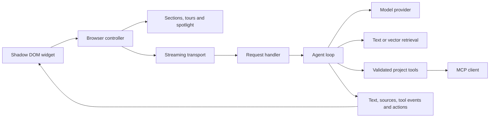

<div align="center">
  
  <h1>OrfinSupport</h1>
  <p><strong>A little guidance goes a long way.</strong></p>
  <p>Meet Orfin — an assistant that understands your product,<br/>shows people where to go, and stays for the follow-up question.</p>
  <p>
    <a href="https://arconw.github.io/OrfinSupport/">Explore the playground</a> ·
    <a href="#bring-orfin-to-your-project">Get started</a> ·
    <a href="docs/API.md">API reference</a> ·
    <a href="docs/INTEGRATIONS.md">Integrations</a>
  </p>
  <p>
    <a href="LICENSE"></a>
    
    
    
  </p>
  
  <p><sub>Recorded from the working playground. Demo replies are labeled; live mode uses your local LLM gateway.</sub></p>
</div>

## A guide that can point

Your visitors can ask a question, take a tour, or point at the part of the interface they want to understand. Orfin connects the conversation to the page in front of them.

| Capability                   | What it does                                                                                                                          |
| ---------------------------- | ------------------------------------------------------------------------------------------------------------------------------------- |
| **Tours with questions**     | Walks through ordered sections with Back, Next and Ask. Continue from inside the chat or return to the current tour step.             |
| **Section picker**           | Highlights the section under the pointer; selecting it starts an explanation. A keyboard-accessible section list is included.         |
| **Thoughtful hover help**    | Offers Yes / No after a configurable dwell time. Outside clicks dismiss it; a cooldown prevents repeated interruptions.               |
| **Navigation and spotlight** | Opens an allowed page, waits for its section, scrolls into view and shades the surrounding viewport at 70% for two seconds.           |
| **Project knowledge**        | Combines a trusted project prompt, section instructions and retrieved documents. Responses can include source links.                  |
| **Your tools and MCP**       | Calls schema-validated server tools and explicitly allowed MCP tools, then continues the answer.                                      |
| **Real streaming**           | Streams text, tool activity, sources and browser actions. Includes cancellation, retry and useful connection errors.                  |
| **Your product’s style**     | Cloud, Midnight and Iris presets; CSS variables and shadow parts. Shadow DOM protects the interface from host styles.                 |
| **16 languages**             | Localizes the widget, tooltips, tours and errors. Switch languages without remounting; the chosen locale also controls model replies. |
| **Configurable behavior**    | Switch features on or off at runtime. Choose marked sections or visible-page context, dwell time, language and memory policy.         |

The library is framework independent. React, Vue and Angular adapters manage the same widget’s lifecycle. Next.js uses the React adapter plus a standard Web `Request → Response` route handler. The widget includes 16 languages, English by default, regional and custom translation fallback, and Arabic RTL layout. Language changes work through widget preferences, configuration and reactive framework APIs. [Localization guide](docs/LOCALIZATION.md).

## Try it locally

```bash
git clone https://github.com/arconw/OrfinSupport.git
cd OrfinSupport
npm ci
npm run dev
```

Open **http://127.0.0.1:4173**. Northstar is a fictional studio workspace with working project filters, project creation, tasks, knowledge articles and an assistant settings playground.

**Demo replies** work without a backend or API credentials, including on GitHub Pages. The public static playground disables **Live AI** and links to local setup. **Live AI** in the local demo sends requests through its server to `http://127.0.0.1:8787/codex/v1`, using `gpt-5.6-sol` by default. The gateway must already be running. The live server automatically connects an actual MCP client/server pair with `workspace_statistics` and `team_capacity`. **Connected tools** in Playground is enabled by default; there is no separate MCP switch.

Try “Show me the active projects”, “What does the Studio plan cost?”, “Open the knowledge page”, or “What is our team capacity this week?”

To try MCP, select **Live AI** and ask: “Please call the connected MCP workspace statistics tool and tell me the completed task count. Use the tool, not the knowledge documents.” Orfin shows **workspace statistics · Done** and reports **24 tasks this week**, using the same fictional data as the overview. Demo replies simulate conversations; actual MCP calls require Live AI and the local backend. The answer follows the language selected in assistant preferences.

For a stable production preview with both Demo replies and Live AI, run `npm run preview:demo` and open **http://127.0.0.1:4189**. It builds an isolated copy of the frontend and API; source edits and subsequent builds do not reload an ongoing review. Start a new snapshot on another port with `npm run preview:demo -- --port 4190`. The gateway is required only for Live AI.

`npm run build:demo` produces the static playground with Live AI disabled. `npm run dev` and `npm run preview:demo` enable it automatically. For a custom demo deployment with a same-origin `/api/orfin` backend, build with `VITE_ORFIN_DEMO_LIVE=true npm run build:demo`.

## Bring Orfin to your project

**Release status:** `0.1.0` is prepared for publication; it has not been published to npm yet. Build and install a local tarball for now:

```bash
npm ci
npm pack
cd /path/to/your-app
npm install /path/to/OrfinSupport/orfinsupport-0.1.0.tgz
```

### 1. Describe your sections

Put public descriptions in a catalog shared by your frontend and backend. Keep sensitive instructions and authorization logic on the server.

```ts
import type { Section } from 'orfinsupport/core';

export const sections: Section[] = [
  {
    id: 'projects',
    title: 'Your projects',
    description: 'Track each project, its people, progress, and next milestone.',
    path: '/projects',
    tourOrder: 0,
  },
];
```

```html
<section data-orfin-section="projects">
  <h2>Your projects</h2>
</section>
```

For simple pages, descriptions can live entirely in markup:

```html
<section
  data-orfin-section="pricing"
  data-orfin-title="Plans and pricing"
  data-orfin-description="Compare the available plans and their included features."
  data-orfin-order="1"
>
  <h2>Find your plan</h2>
</section>
```

### 2. Mount the assistant

```ts
import { createOrfin } from 'orfinsupport';
import { sections } from './sections';

const orfin = createOrfin({
  endpoint: '/api/orfin',
  sections,
  theme: 'cloud',
  features: { hoverHelp: true },
  navigate: (path) => router.push(path),
  allowedPaths: ['/projects'],
});

orfin.updateSettings({ hoverDelay: 3000 });
```

Call `orfin.destroy()` when the host view unmounts. Without a router callback, allowed navigation uses a full page load and briefly stores the destination section in session storage so the next mount can highlight it.

### 3. Connect your backend

For Next.js, put this in `app/api/orfin/route.ts`. The same handler works anywhere that accepts standard Web requests and responses.

```ts
import { createOrfinHandler, createOpenAICompatible } from 'orfinsupport/server';
import { sections } from '@/lib/sections';

export const POST = createOrfinHandler({
  provider: createOpenAICompatible({
    baseURL: process.env.ORFIN_API_URL!,
    apiKey: process.env.ORFIN_API_KEY,
    model: process.env.ORFIN_MODEL!,
  }),
  context: 'Our product helps creative teams plan and deliver client projects.',
  sections: sections.map((section) => ({
    ...section,
    prompt: 'Explain the workflow clearly. Never claim a project was modified.',
  })),
  allowedPaths: ['/projects'],
});
```

Set `ORFIN_API_URL`, `ORFIN_API_KEY` and `ORFIN_MODEL` in the **host application's server environment**. They must not use a public frontend prefix such as `NEXT_PUBLIC_` or `VITE_`. The library does not load environment files or include credentials. [Authentication, request limits and deployment boundaries](docs/INTEGRATIONS.md#server-boundaries).

## Frameworks

<table>
<tr><th>React / Next.js</th><th>Vue</th><th>Angular</th></tr>
<tr><td><code>orfinsupport/react</code><br/>Provider, reactive <code>useOrfin()</code> hook and automatic cleanup.</td><td><code>orfinsupport/vue</code><br/>Component and <code>useOrfin()</code> composable with writable locale.</td><td><code>orfinsupport/angular</code><br/>Environment provider, controller and <code>injectOrfin()</code> signals.</td></tr>
</table>

```tsx
'use client';

import { OrfinSupport } from 'orfinsupport/react';

export function Assistant() {
  return <OrfinSupport options={{ endpoint: '/api/orfin', theme: 'cloud' }} />;
}
```

See [framework recipes](docs/INTEGRATIONS.md#framework-recipes) and the [runnable Next.js example](examples/next). The React distribution preserves its `use client` boundary. Server imports do not access the DOM. Changing feature settings updates a mounted adapter; remount it when replacing the transport, catalog or router.

## Change the language

```ts
const orfin = createOrfin({ endpoint: '/api/orfin', locale: 'en' });
orfin.setLocale('ja');
```

Visitors can also choose a language in assistant preferences. React exposes `useOrfin().setLocale()`, Vue exposes a writable `locale` computed ref, and Angular exposes `injectOrfin().locale()` and `setLocale()`. Supply partial `translations` overrides or localized section descriptions; missing text falls back to English. [Examples and fallback behavior](docs/LOCALIZATION.md).

## Models and context

`createOpenAICompatible` speaks the Chat Completions streaming protocol. Use it with an OpenAI-compatible service, a local gateway, or your own endpoint. `createAnthropic` supports the native Anthropic Messages streaming protocol. Implement `ModelProvider` to add another provider; implement `ChatTransport` to own the entire browser/server conversation.

For text-only gateways such as `llm-gate`, use `toolMode: 'prompt'`. The provider parses a dedicated tool-call envelope and routes it through the **same allowlist, argument validator and execution limits** as native function calling. Ordinary responses still stream. Model compliance with that envelope is required; malformed calls produce a recoverable error.

For retrieval, use `createTextRetriever` for small document sets or `createVectorRetriever({ embed, search })` to connect your vector database. Your search callback owns tenant filters and access control. [Vector search example](docs/INTEGRATIONS.md#retrieval-and-vector-databases).

```ts
import { createTextRetriever } from 'orfinsupport/server';

const retriever = createTextRetriever([
  {
    id: 'onboarding',
    title: 'Getting started',
    content: 'Create a workspace, invite your team, then add your first project.',
    url: '/docs/getting-started',
  },
]);
```

## Tools that belong to your product

```ts
import type { Tool } from 'orfinsupport/server';

const projectStatus: Tool = {
  name: 'project_status',
  description: 'Read a project’s current progress.',
  parameters: {
    type: 'object',
    properties: { projectId: { type: 'string' } },
    required: ['projectId'],
    additionalProperties: false,
  },
  async execute({ projectId }, { identity, signal }) {
    return projectService.getAuthorizedStatus(identity, String(projectId), signal);
  },
};
```

Pass tools to `createOrfinHandler`. `authorize` supplies request-scoped identity to tools and retrieval. Browser feature switches are UX controls; backend settings and application permissions are authoritative.

To connect a Streamable HTTP MCP server, install the optional SDK peer and allow only the tools the assistant should use:

```ts
import { connectMCP } from 'orfinsupport/mcp';

const workspace = await connectMCP({
  url: 'https://your-project.example/mcp',
  allow: ['team_capacity', 'project_status'],
  prefix: 'workspace_',
});
```

Pass `workspace.tools` to the handler and call `workspace.close()` on shutdown. An existing MCP client, including a stdio client, can use `toolsFromMCP`. Discovery supports pagination; execution forwards cancellation. [MCP lifecycle and permissions](docs/INTEGRATIONS.md#mcp).

## A style that belongs

Choose **Cloud**, **Midnight**, or **Iris**, then override individual tokens:

```ts
createOrfin({
  endpoint: '/api/orfin',
  theme: 'iris',
  themeVariables: {
    '--orfin-accent': '#6951ad',
    '--orfin-font': 'YourBrandFont, system-ui, sans-serif',
    '--orfin-radius': '18px',
    '--orfin-width': '390px',
  },
});
```

The widget uses Shadow DOM and the browser top layer where available, with a high stacking fallback. Host CSS can target `::part(panel)`, `::part(header)`, `::part(conversation)`, `::part(composer)` and `::part(launcher)`. A `nonce` option supports nonce-authorized style elements. CSS variables remain available for external theming. [Complete settings and style reference](docs/API.md).

## What Orfin remembers

By default, section choices are stored in session storage for 24 hours, subject to the browser session lifetime. Conversation messages are held in memory and are not persisted by the library. Choose local storage, session storage, or memory-only storage. Visited sections and declined help have independent switches. Visitors can clear their section history.

Only marked sections are used by default. Whole-page extraction requires an explicit opt-in on both client and server. It reads visible text, omits form values, and excludes any subtree marked `data-orfin-private`. Treat all page and retrieval text as data; put trusted technical instructions in the server section catalog.

## Architecture



`src/core` contains shared contracts, settings, retrieval and the wire protocol. `src/browser` owns interaction and rendering. `src/providers`, `src/server` and `src/mcp` isolate the AI integrations. Thin adapters live in `src/adapters`. The demo is a consumer of those same modules.

## Verification

```bash
npm run check
npx playwright install chromium
npm run test:e2e
npm run test:demo
npm run dev
npm run test:live
npm run test:live:browser
npm install --prefix examples/next
npm run test:next
```

The automated suite covers fragmented SSE and Unicode, tool argument validation, feature gates, origin/auth/body limits, tool failures, cancellation, retrieval, a real MCP connection, storage behavior, tours with follow-up questions, section picking, full-page navigation, mobile layout, accessibility and framework lifecycles. Live checks require the local gateway; ordinary CI does not. See [the validation record](docs/TESTING.md) for the tested scope and limitations.

`npm run capture:demo` regenerates the GIF and screenshots from a running playground. `npm run build:demo` builds the static site.

## Repository and release

- **`main`** — library source, tests, documentation, examples and demo source.
- **`demo`** — built static playground, served by GitHub Pages. The editable demo source lives on `main`.
- **npm** — publication is deliberately separate from repository builds. No workflow publishes a package automatically.

Ready-to-enable CI templates are in `.github/workflow-templates/`. Move them into `.github/workflows/` with a GitHub credential that has the `workflow` scope. The initial publication uses branch-based Pages because the available credential cannot create workflows.

The supported baseline is modern browsers with Shadow DOM, Fetch streams, ResizeObserver and `Element.checkVisibility`; the server baseline is Node.js 20.19+. Tests currently run in Chromium. The public static playground uses sample replies; real AI needs your backend. Cross-origin navigation is not enabled. Authentication, rate limiting, tool authorization, provider billing and production data policies belong to the host application.

Contributions are welcome. See [CONTRIBUTING.md](CONTRIBUTING.md). Released under the [MIT license](LICENSE).
