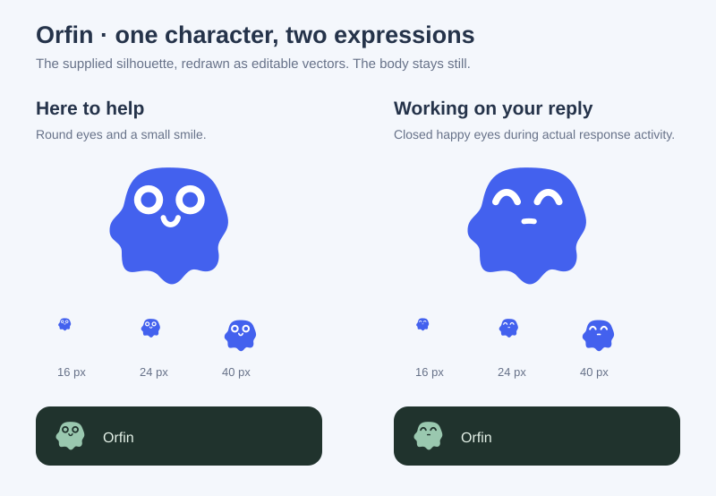

# OrfinSupport design direction

Orfin is a small guide who belongs in the product. The demo is Northstar, a creative team's project workspace. Actual project cards, a capacity chart, upcoming tasks and a useful knowledge area give the guide something meaningful to explain.

## Tokens

| Name   | Value     | Role                           |
| ------ | --------- | ------------------------------ |
| Cloud  | `#f4f7fc` | Workspace canvas               |
| Paper  | `#ffffff` | Surfaces                       |
| Ink    | `#25334a` | Text                           |
| Cobalt | `#4361ee` | Actions and Orfin's identity   |
| Ice    | `#e7edff` | Selected and contextual states |
| Fern   | `#dff2e4` | Positive progress              |

Manrope sets the workspace headings and Inter carries the interface and conversation text. Inter uses its text-size outlines at weight 450 for ordinary text; labels and actions use medium or semibold weights. Type is left aligned. The workspace uses `#162235` for primary text and has a 16px base with a 1.5 line height, 15–16px reading text and 12–14px compact labels. Secondary text uses `#354259` so navigation, dates and chart labels remain distinct against the pale canvas. Mobile layouts preserve readable type and wrap or scroll dense content instead of shrinking labels. Main content uses a generous 32px rhythm, and the assistant uses a softer 20px shell with tighter interior controls.

The demo and Next example load the font locally. Their shared `demo/assistant-typography.css` uses the public CSS variable and shadow parts to give user messages, assistant replies and the composer 14px type. Overrides apply only to preset themes; the project-owned serif appearance stays independent. The library itself does not bundle a font.

Documentation captures use the current demo styles. The GIF is recorded at its native 1080px width without resampling text; static screenshots retain their original browser pixels.

## Layout

The product itself is the opening demonstration. A narrow library toolbar sits above a navigable workspace. Its left navigation is 260px wide on large screens, with matching content offsets and narrower tablet variants. On mobile it opens as a 260px drawer. The assistant floats at the lower right. A blue, illustrated welcome panel is the single expressive surface; the surrounding workspace stays quiet.

```text
┌ OrfinSupport / interactive playground ───── controls ┐
├──────────┬───────────────────────────────────────────┤
│Northstar │ breadcrumb                          user │
│          ├───────────────────────────────────────────┤
│Overview  │ Workspace overview          Take a tour  │
│Projects  │ ┌ welcome / orbital map ┐ ┌ team pulse ┐ │
│Knowledge │ └──────────────────────┘ └────────────┘ │
│Settings  │ Active projects           ┌────────────┐ │
│          │ project / project         │ Orfin      │ │
│team      │ activity / next up        │            │ │
└──────────┴───────────────────────────┴────────────┴─┘
```

## Review before implementation

An isolated marketing hero would hide the key feature: interacting with a real page. The workspace therefore opens immediately. Cards correspond to projects, tasks and metrics rather than a uniform grid of feature claims. Decorative motion is restricted to the small Orfin identity; other motion answers a user action. A cobalt palette evokes guidance and focus while the fern and peach project artwork distinguish real work items.

The widget supports preset tokens, CSS custom properties and shadow parts. Keyboard navigation, high contrast, safe-area spacing and reduced motion are first-class. The default spotlight preserves approximately 85% of the background brightness, without mutating the selected element or its ancestors.

## Expanded workspace

Keep Northstar's cobalt, paper, ink, ice and fern palette and the existing type pairing. Add a studio equipment shop and a delivery report. These are places to accomplish a task: inspect a trend, read the evidence, compare equipment, and adjust a demonstration cart.

The report gives most of its width to a chart, followed by a compact segment table and an evidence ledger. The shop uses a quiet product stage with equipment silhouettes, an asymmetric featured product, and a specification table. Cart rows are compact, with quantities next to prices. They do not reuse the overview's project-card layout.

```text
Report                              Equipment
Delivery trend / period selector    Featured monitor / product silhouette
┌ weekly comparison chart ───────┐   ┌ catalog ─────────┐ ┌ session cart ┐
└───────────────────────────────┘   └──────────────────┘ └──────────────┘
Segment / delivered / lead time     Product / specifications / reviews
Evidence / observation / caveat     Two-product comparison / suitability
```

Ten assistant presets form two families of five. Cloud, Iris, Lagoon, Sand and Rose are light; Midnight, Graphite, Forest, Plum and Espresso are dark. Each defines a complete palette, shell radius, header treatment and shadow. The product hierarchy remains consistent across themes; dark presets use bright accents with dark text on filled actions. A supplied logo occupies the same reserved area in every assistant surface, with the Orfin mark as fallback.

Review: a grid of ten miniature dashboard cards would confuse theme selection with the product demo. Keep theme samples compact in the playground; spend the expressive design on the report and product illustrations. Motion follows actions: retain the spotlight while its target changes and fade its mask in and out. Nothing should flash or obscure tour controls.

Design process informed by [Anthropic's frontend-design skill](https://github.com/anthropics/skills/tree/main/skills/frontend-design).

## Orfin identity

The current character follows the supplied visual reference: a rounded cobalt body with an organic, scalloped lower edge, large round eyes with white rims and body-colored pupils, and a small smile. Its second expression borrows only the happy closed eye arcs and short mouth from the expression reference. The body stays the same; neither grain nor a drawn outline is introduced.

The facial features and their spacing are optically enlarged by approximately 25% for miniature use, with slightly stronger mouth strokes. Both expressions are checked at native 16, 24 and 40 pixels at DPR 1 on light and dark surfaces. The eye openings stay separate, the smile retains its curve, and the original body path and overall mark size are preserved.



Body, eye positions, stroke widths and both expressions come from `src/core/brand.ts`. `npm run build:brand` updates the standalone SVG, favicon and expression sheet. Static branding always shows the open eyes and smile. The widget inherits its body color from the surrounding theme; `--orfin-eye` or the exported face part controls the contrasting features. The default demo branding uses a cobalt body and white face on a pale background. Northstar's compass remains a separate identity.

Real controller activity changes the header, launcher and active message expression. Previous messages remain idle. The facial layers crossfade and gently compress over the existing 300 ms arrival timing; they reverse smoothly if a request is stopped quickly. A new text chunk does not recreate a face or restart an animation. Reduced motion changes the expression without movement. Supplied project images never receive facial animation, and failed image loads use the current default expression as fallback.

Motion follows a single rhythm: 140 ms control feedback, 240 ms content transitions, 300 ms panel arrival and 180 ms exit. The welcome gets one short stagger; messages enter once and streaming changes only their text. Tool states, preferences, locale labels and theme surfaces acknowledge changes. No animation blocks typing. Panel and menu exits retain inert content briefly so closing feels as deliberate as opening. OS reduced motion and a reactive off switch stop animation immediately.

The composer has a visibly labelled Actions menu with a 44 px target, tinted resting state and distinct expanded state. It remains available after welcome suggestions disappear. Tour, section and page commands respect feature flags; keyboard behavior follows a menu button, and closing returns focus predictably. Its appearance is fully replaceable through project CSS, like the rest of the assistant.

Project commands share this menu rather than introducing another toolbar. The catalog contributes Compare products and the report contributes Analyze delivery. Stable IDs retain focus when commands move; disappearing commands leave focus on another eligible action or the composer. Preferences crossfade with a retained chat view, preserving scroll and drafts. A small writing signal follows received text, and Stop ends pending tool motion without suggesting that server effects were rolled back.

The host appearance example deliberately changes typography, corners and control treatment: warm paper, forest ink, serif headings and double-rule separators. It uses no preset stylesheet. Functional geometry and reduced-motion behavior remain library concerns; application CSS supplies every visual surface. The mobile theme gallery uses a three-column grid and never expands the page width.
