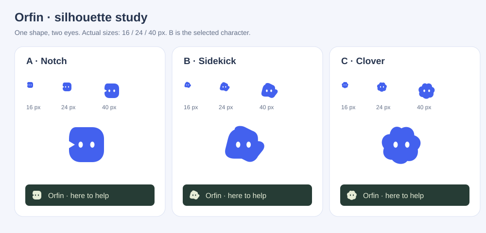

# OrfinSupport design direction

Orfin is a small guide who belongs in the product. The demo is Northstar, a creative team's project workspace. Actual project cards, a capacity chart, upcoming tasks and a useful knowledge area give the guide something meaningful to explain.

## Tokens

| Name   | Value     | Role                           |
| ------ | --------- | ------------------------------ |
| Cloud  | `#f4f7fc` | Workspace canvas               |
| Paper  | `#ffffff` | Surfaces                       |
| Ink    | `#25334a` | Text                           |
| Cobalt | `#4361ee` | Actions and Orfin's identity   |
| Ice    | `#e7edff` | Selected and contextual states |
| Fern   | `#dff2e4` | Positive progress              |

Manrope sets the workspace headings and DM Sans carries readable UI text. Type is left aligned. Main content uses a generous 32px rhythm, compact data uses 12–16px, and the assistant uses a softer 20px shell with tighter interior controls.

## Layout

The product itself is the opening demonstration. A narrow library toolbar sits above a navigable workspace. The assistant floats at the lower right. A blue, illustrated welcome panel is the single expressive surface; the surrounding workspace stays quiet.

```text
┌ OrfinSupport / interactive playground ───── controls ┐
├──────────┬───────────────────────────────────────────┤
│Northstar │ breadcrumb                          user │
│          ├───────────────────────────────────────────┤
│Overview  │ Workspace overview          Take a tour  │
│Projects  │ ┌ welcome / orbital map ┐ ┌ team pulse ┐ │
│Knowledge │ └──────────────────────┘ └────────────┘ │
│Settings  │ Active projects           ┌────────────┐ │
│          │ project / project         │ Orfin      │ │
│team      │ activity / next up        │            │ │
└──────────┴───────────────────────────┴────────────┴─┘
```

## Review before implementation

An isolated marketing hero would hide the key feature: interacting with a real page. The workspace therefore opens immediately. Cards correspond to projects, tasks and metrics rather than a uniform grid of feature claims. Decorative motion is restricted to the small Orfin identity; other motion answers a user action. A cobalt palette evokes guidance and focus while the fern and peach project artwork distinguish real work items.

The widget supports preset tokens, CSS custom properties and shadow parts. Keyboard navigation, high contrast, safe-area spacing and reduced motion are first-class. The default spotlight preserves approximately 85% of the background brightness, without mutating the selected element or its ancestors.

## Expanded workspace

Keep Northstar's cobalt, paper, ink, ice and fern palette and the existing type pairing. Add a studio equipment shop and a delivery report. These are places to accomplish a task: inspect a trend, read the evidence, compare equipment, and adjust a demonstration cart.

The report gives most of its width to a chart, followed by a compact segment table and an evidence ledger. The shop uses a quiet product stage with equipment silhouettes, an asymmetric featured product, and a specification table. Cart rows are compact, with quantities next to prices. They do not reuse the overview's project-card layout.

```text
Report                              Equipment
Delivery trend / period selector    Featured monitor / product silhouette
┌ weekly comparison chart ───────┐   ┌ catalog ─────────┐ ┌ session cart ┐
└───────────────────────────────┘   └──────────────────┘ └──────────────┘
Segment / delivered / lead time     Product / specifications / reviews
Evidence / observation / caveat     Two-product comparison / suitability
```

Ten assistant presets form two families of five. Cloud, Iris, Lagoon, Sand and Rose are light; Midnight, Graphite, Forest, Plum and Espresso are dark. Each defines a complete palette, shell radius, header treatment and shadow. The product hierarchy remains consistent across themes; dark presets use bright accents with dark text on filled actions. A supplied logo occupies the same reserved area in every assistant surface, with the Orfin mark as fallback.

Review: a grid of ten miniature dashboard cards would confuse theme selection with the product demo. Keep theme samples compact in the playground; spend the expressive design on the report and product illustrations. Motion follows actions: retain the spotlight while its target changes and fade its mask in and out. Nothing should flash or obscure tour controls.

Design process informed by [Anthropic's frontend-design skill](https://github.com/anthropics/skills/tree/main/skills/frontend-design).

The default Orfin character is an asymmetric rounded companion with two tall eyes and a small side protrusion. There is no speech tail or four-point star. Three SVG silhouettes were compared at actual 16, 24 and 40 px: a geometric notch, the selected companion, and a soft clover. The companion keeps more character at small sizes without the clover's familiar flower outline. Body and eyes share one vector source across the widget and demo brand; inverted branding preserves eye contrast. This identity is separate from Northstar’s compass symbol. Custom logos retain a reserved, consistent footprint.



Motion follows a single rhythm: 140 ms control feedback, 240 ms content transitions, 300 ms panel arrival and 180 ms exit. The welcome gets one short stagger and blink; messages enter once and streaming changes only their text. Tool states, preferences, locale labels and theme surfaces acknowledge changes. No animation blocks typing. Panel and menu exits retain inert content briefly so closing feels as deliberate as opening. OS reduced motion and a reactive off switch stop animation immediately.

The composer has a visibly labelled Actions menu with a 44 px target, tinted resting state and distinct expanded state. It remains available after welcome suggestions disappear. Tour, section and page commands respect feature flags; keyboard behavior follows a menu button, and closing returns focus predictably. Its appearance is fully replaceable through project CSS, like the rest of the assistant.

The host appearance example deliberately changes typography, corners and control treatment: warm paper, forest ink, serif headings and double-rule separators. It uses no preset stylesheet. Functional geometry and reduced-motion behavior remain library concerns; application CSS supplies every visual surface. The mobile theme gallery uses a three-column grid and never expands the page width.
